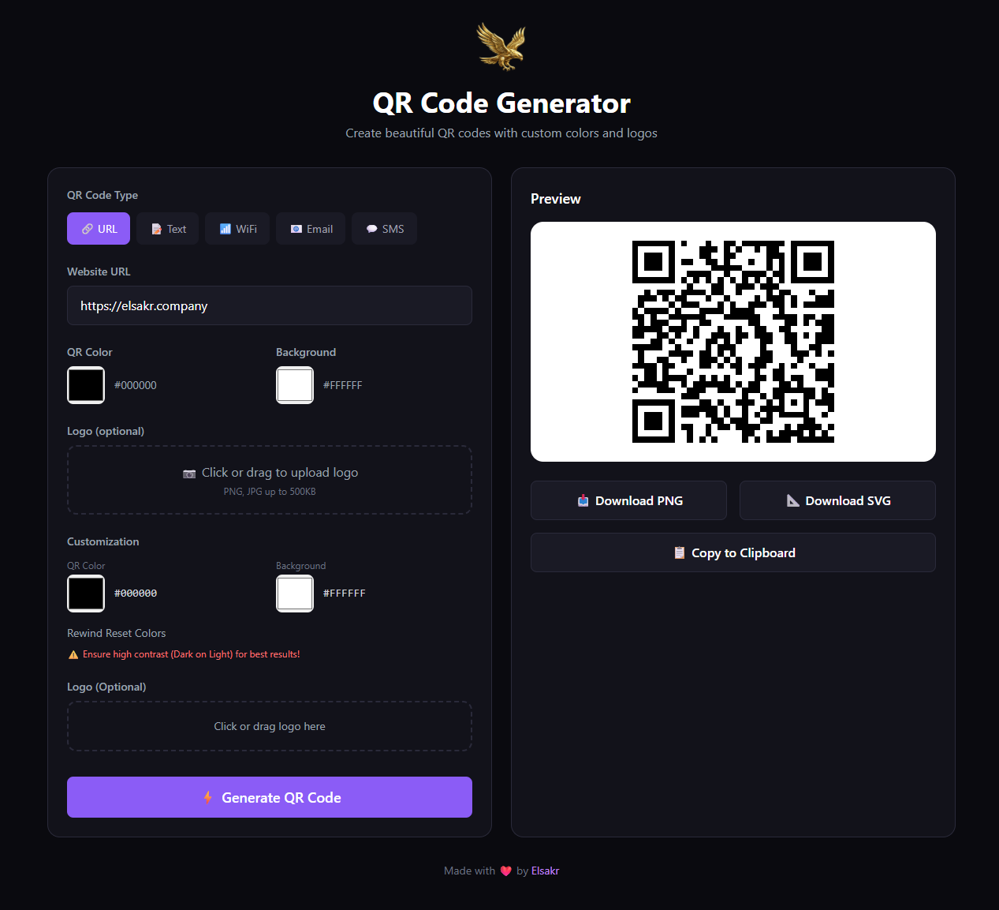

# 🦅 Elsakr QR Code Generator (Web)

[](https://elsakr.company)
[](https://elsakr.company)
[](LICENSE)


## Overview
Part of the **Elsakr Open Source Tools Ecosystem** — global proactive solutions for developers, designers, and marketers.
> **[View All Tools](https://elsakr.company/tools)**

**Generate stunning QR codes with custom colors and embedded logos.**
A browser-based tool that creates QR codes for URLs, WiFi networks, emails, SMS, and text — all processed locally in your browser. No server uploads. No tracking.

## 🛠 Features
- 🔹 **5 QR Types**: URL, Text, WiFi, Email, SMS.
- 🔹 **Custom Colors**: Choose foreground and background colors.
- 🖼 **Logo Overlay**: Embed your brand logo (in center or on top with frame).
- 🖼 **Frame Mode**: Add decorative frame with logo on top, QR in middle, and custom text at bottom.
- 🎨 **Frame Color Options**: Customize logo background, text color, and text background.
- 💾 **Export Options**: Download as PNG or SVG.
- 🔒 **100% Local**: Privacy first — nothing leaves your browser.

## 📸 Screenshots / Demo


🔗 **Live Demo:** [https://khalidsakrjoker.github.io/Elsakr-QR-Code-Generator-Web/](https://khalidsakrjoker.github.io/Elsakr-QR-Code-Generator-Web/)

## 📦 Getting Started

### 🔧 Installation
Clone the repo for local development:
```bash
git clone https://github.com/khalidsakrjoker/Elsakr-QR-Code-Generator-Web.git
```

### ▶️ Usage
1. **Select Type**: Choose QR type (URL, WiFi, Text, etc.).
2. **Enter Data**: Fill in the required fields.
3. **Customize**: Pick colors and upload a logo (optional).
4. **Generate**: Click "Generate QR Code".
5. **Download**: Save as PNG or SVG.

## 🤝 Contributing
We welcome contributions!
1. Fork the repo.
2. Create your branch.
3. Push changes.
4. Open a Pull Request.

## 📝 License
This project is licensed under the MIT License.

## ⭐ Signature
**Elsakr** — *Open Source Tools with a Falcon's Vision.*  
[elsakr.company](https://elsakr.company)

---

# 🇪🇬 النسخة العربية (Arabic Version)

## 🦅 مولد أكواد الـ QR (Web Version)
أداة مجانية على المتصفح لإنشاء أكواد QR احترافية بألوان مخصصة ولوجو في المنتصف. يدعم 5 أنواع: روابط، واي فاي، إيميل، ورسائل SMS.
**100% على جهازك — بياناتك مابتخرجش.**
